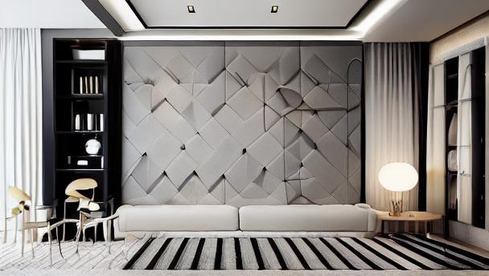

# 🏠 AI Interior Designer — Furnish Empty Rooms with AI
---
This project transforms **empty room images** into **Furnished Images** using **Stable Diffusion**, acting like a virtual interior designer. It adds sofas, rugs, and essential furniture to visualize fully-furnished rooms from bare spaces.
<table align="center">
  <tr align="center">
    <td>
      <br/>
      <strong>Empty Room</strong>
    </td>
    <td style="font-size: 30px; vertical-align: middle;">
      ➡️
    </td>
    <td>
      <br/>
      <strong>Furnished Room</strong>
    </td>
  </tr>
</table>


---

## 🎯 Project Goal

To help interior designers, homeowners, and architects visualize furniture arrangements and decor in empty rooms — instantly and creatively — with the power of generative AI.

---

## ✨ Features

- 🛋️ **AI-Powered Furnishing**: Automatically adds sofas, rugs, and basic decor to empty rooms.
- 🧠 **Stable Diffusion Based**: Uses pretrained (or fine-tuned) diffusion models for high-quality image generation.
- 📷 **Image-to-Image Translation**: Input an empty room → Output a beautifully furnished room.
---

## 🛠 Tech Stack

- **Python 3.8+**
- **Stable Diffusion** (via Hugging Face )
- **PyTorch**
- **Diffusers Library**
- **OpenCV** (image preprocessing)

---

## 🚀 Getting Started

### 1. Clone the Repo

```bash
git clone https://github.com/YourUsername/AI-Interior-Designer.git
cd AI-Interior-Designer
